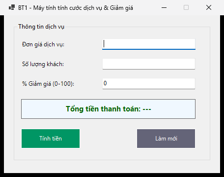
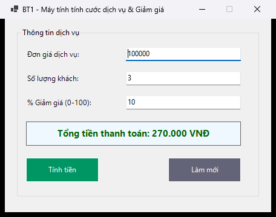
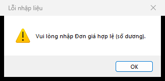

# BÁO CÁO BÀI TẬP / ĐỒ ÁN

## THÔNG TIN SINH VIÊN

- **Họ và tên:** Phạm Tuấn Thành
- **Mã số sinh viên:** 24810320264
- **Lớp:** [Chờ xác nhận lớp]
- **Tên môn học:** Lập trình C# / Windows Forms
- **Tên bài tập:** Bài 1 — Máy tính tính cước dịch vụ & Giảm giá

## MÔ TẢ BÀI TẬP

Ứng dụng tính tiền dịch vụ từ đơn giá, số lượng khách và phần trăm giảm giá.

- 3 TextBox nhập đơn giá, số lượng khách và % giảm; Label tổng tiền; nút Tính tiền và Làm mới.
- Thứ tự Tab: đơn giá → số lượng → giảm giá → Tính tiền → Làm mới.
- MessageBox cảnh báo khi nhập chữ, để trống, giá/số lượng không dương hoặc giảm giá ngoài 0–100%.
- Tổng tiền = Đơn giá × Số lượng × (100 − % giảm) / 100; dùng decimal.
- Làm mới xóa dữ liệu và kết quả; xử lý giá trị quá lớn bằng thông báo.

## ĐỐI CHIẾU YÊU CẦU

| Mã | Nội dung đã triển khai | File chính |
|---|---|---|
| R1-1 | 3 TextBox nhập đơn giá, số lượng khách và % giảm; Label tổng tiền; nút Tính tiền và Làm mới. | `MainForm.cs` / `MainForm.Designer.cs` |
| R1-2 | Thứ tự Tab: đơn giá → số lượng → giảm giá → Tính tiền → Làm mới. | `MainForm.cs` / `MainForm.Designer.cs` |
| R1-3 | MessageBox cảnh báo khi nhập chữ, để trống, giá/số lượng không dương hoặc giảm giá ngoài 0–100%. | `MainForm.cs` / `MainForm.Designer.cs` |
| R1-4 | Tổng tiền = Đơn giá × Số lượng × (100 − % giảm) / 100; dùng decimal. | `MainForm.cs` / `MainForm.Designer.cs` |
| R1-5 | Làm mới xóa dữ liệu và kết quả; xử lý giá trị quá lớn bằng thông báo. | `MainForm.cs` / `MainForm.Designer.cs` |

## CÁCH MỞ VÀ CHẠY

Yêu cầu Windows, .NET 10 SDK và Visual Studio 2026 có workload **.NET desktop development**.

1. Mở `ServiceChargeCalculator.sln` bằng Visual Studio 2026.
2. Nhấn **F5** để chạy ứng dụng.
3. Để thiết kế UI: chọn `MainForm.cs` trong Solution Explorer → **Shift+F7** hoặc **View Designer**.
4. Trong Designer, **Ctrl+Alt+X** mở Toolbox. **F7** trở về code.

Chạy bằng terminal tại thư mục repo:

```powershell
dotnet restore ServiceChargeCalculator.sln
dotnet build ServiceChargeCalculator.sln
dotnet run --project src/ServiceChargeCalculator/ServiceChargeCalculator.csproj
```

UI tĩnh nằm trong `MainForm.Designer.cs`; xử lý sự kiện nằm trong `MainForm.cs`; tài nguyên form nằm trong `MainForm.resx`.

## HƯỚNG DẪN SỬ DỤNG

1. Nhập đơn giá `100000`, số lượng `3`, giảm giá `10`; bấm **Tính tiền**, kết quả là **270.000 VNĐ**.
2. Bấm **Làm mới** để xóa đơn giá, số lượng và kết quả; giảm giá trở về 0.
3. Để trống hoặc nhập `abc` vào một ô số rồi bấm Tính tiền để xem cảnh báo.

## KIỂM THỬ

Build bản sửa trên Windows: **0 lỗi, 0 cảnh báo**. Đã chạy 12/12 kiểm tra đạt với vi-VN.

Xem [bảng kiểm thử](./docs/TESTING.md) và [kết quả chạy](./docs/test-results.json). Kết quả tự động không thay thế việc kiểm tra kéo thả Designer và thao tác GUI ở mọi mức DPI.

## GIẢ ĐỊNH VÀ PHẠM VI

Giá và số lượng phải > 0; số lượng là số nguyên. Giảm giá nhận cả 0% và 100%.

## KẾT QUẢ THỰC HÀNH

### 1. Giao diện chính



### 2. Chức năng thực thi / Kết quả



### 3. Kiểm tra lỗi / Validation



Thư mục `screenshots/` dùng để lưu ảnh chạy thực tế. Giữ đúng tên ảnh trên để README hiển thị trực tiếp trên GitHub.

## QUY TRÌNH NỘP VÀ PUSH

Repo đã được khởi tạo trên nhánh `main` và liên kết `origin`. Sau khi thay đổi code, README hoặc screenshot, chạy:

```powershell
git config user.name "Pham Tuan Thanh"
git config user.email "tuanthanhpham206@gmail.com"
git status
git add .
git commit -m "Nop bai tap BT1 - MSSV 24810320264 - Pham Tuan Thanh"
git push -u origin main
```

`.gitignore` bỏ qua `bin/`, `obj/`, `.vs/`, `*.user`, `*.suo`. Đăng nhập bằng Git Credential Manager; không đặt token trong URL remote hoặc mã nguồn.

## CHECKLIST TRƯỚC KHI NỘP

- [x] README có họ tên và MSSV.
- [ ] README đã điền lớp thật.
- [ ] `screenshots/` có đủ 3 ảnh chạy thực tế.
- [ ] Ảnh hiển thị trực tiếp trên trang chính GitHub.
- [x] `.gitignore` loại tệp build và cấu hình cá nhân của Visual Studio.
- [x] Repository Public.
- [x] Mã nguồn bản sửa và tài liệu đã commit/push lên nhánh `main`.
